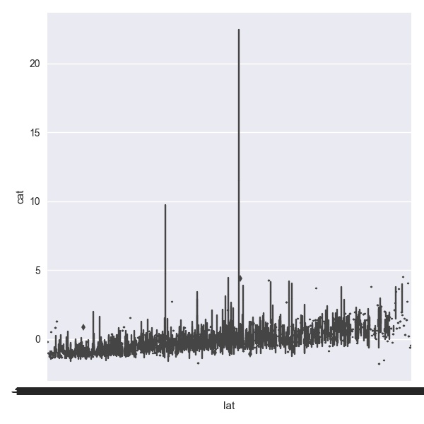
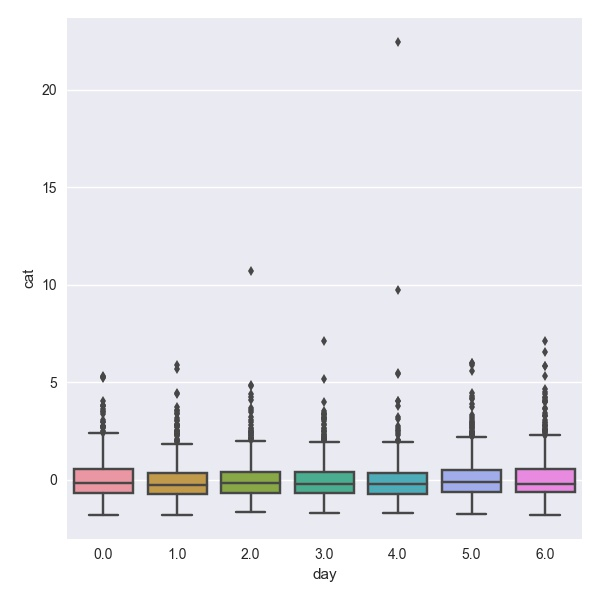
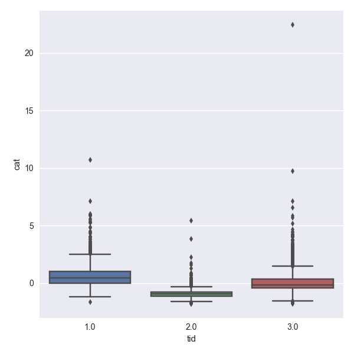

# KDD CUP2017

the answer of universe

李则言 陈光斌 陈禹东

---

## 最终成绩

### Travel Time Prediction

未在线评测

### Volume Prediction

MAPE： 	0.1760

Rank：	55

## 最初的尝试——直接拟合曲线

最开始的时候希望直接拟合travel time和volume曲线之前若干点到某一点的映射。即对于一个连续的时间序列$\vec{a}$，我们希望得到一个$<\vec{a}_{i-k},\vec{a}_{i-k+1},......\vec{a}_{i-1}>\to<\vec{a}_i>$的映射。

也就是说对于travel time和volume两个问题，分别训练这样的映射：

$$
<\text{tollgate}, \text{intersection}, \text{previous average travel time}, \\ \text{previous average volume}, \text{daily time}, \text{day of week}, \text{weather features}> \\
\to <\text{average travel time}>
$$

$$
<\text{tollgate}, \text{direction}, \text{previous average volume}, \text{daily time}, \text{day of week}, \text{weather features}> \\ 
\to <\text{average volume}>
$$

在travel time prediction中，我们认为之前时间段的average volume也是有影响的。同时每天的不同时间（daily time），星期几（day of week）以及天气数据（weather features）都是有影响的。为此需要按照顺序提取天气，流量和通过时间的数据：

``` python
weather_data = extract_weather(FLAGS.weather_input, FLAGS.weather_raw_data)
weather_data = weather_data[weather_data[:, 0].argsort()]
volume_data = extract_volume_naive(FLAGS.volume_input, FLAGS.volume_raw_data, weather_data)
volume_data = volume_data[volume_data[:, -1].argsort()]
travel_time_data = extract_travel_time_naive(FLAGS.travel_time_input, FLAGS.travel_time_raw_data, volume_data)    
```

为了平滑数据以及便于使用一些分类模型来处理问题，我们将average travel time和average volume按照等深或者等宽的方法分成若干个桶，然后将训练数据和测试数据都转化为桶标签（而不是连续的值）。模型给出的结果也是桶标签，我们再将这个桶的平均值作为预测的结果。

在本地，我们使用k-fold cross validation的方法来进行测试。经过测试，发现使用Decision Tree， Random Forest， SVC， MLP等模型得到的分类的准确率（Accuracy）最高的连一半都不到。于是我们判断直接拟合曲线这种策略不太可行。

## 简单的数据分析

首先我们使用将之前直接拟合曲线训练出的决策树绘制出来，以判断哪些feature的影响是重要的。(图片太小可以查看`report/`下的原图片) 


可以看到，起到至关重要作用的只有previous average travel time(lat)和previous average volume(lav)，其次是tollgate id和intersection id和daily time，而剩下的其他因素影响就十分微弱了。这样的关系倒是也符合直观的认知，但是太简单，不能准确地预测目标。

还可以直接绘制分布图来看它们之间的关联：

- *previous average volume* $\to$ *current average volume*

  

  可以看出相关性是非常明显的，但是数据点的异常值特别多，所以必须要 进行一些处理，至少也应该使用一些更加鲁棒的模型。

- *last travel time* $\to$ *average travel time*

  

  相关性也很明显，同样，有很多明显的异常值和异常分布。

- *day of week* $\to$ *average travel time* or *average volume*

  

  

  星期几对数据的影响不大

- *tollgate* $\to$ *average travel time or average volume*

  

  

  不同收费站之间的差别是比较大的，因此不同收费站分别训练模型可能会比将收费站id作为一个参数会更好.


## Volumn部分

1、one-hot编码

一开始的星期几表示我们使用数字表示（比如星期一对应0,星期二对应1），但在经过思考以及采取其他同学意见后，我们决定采用one-hot编码（比如星期一对应1000000，星期二对应0100000）。


2、数据清洗

在KDD CUP进行到第二轮时，由于发现用于测试的那几天不包含国庆节，故我们将训练数据中10月1号到10月7号的数据全部删除，因为这几天的收费站流量明显高于其他天数，将这些特殊数据删掉更有利于最终的预测。在进行了数据清洗之后，本地测试的MAPE从0.18~0.19下降到0.16~0.17，效果大大提升。


### 最初的KNN调参

实现KNN算法后，我们对算法的主要参数进行了调参：

- k：相邻的天数
- num_bin：流量分桶的数目
- feature_weight：每一个feature所占的比重（后来弃用）

调参的方法为多轮交叉验证。

通过对KNN的调参，并将KNN的结果与sklearn的决策树（DT）、随机森林（RF）交叉验证结果进行对比，我们发现在参数合适的前提下，KNN算法的效果比DT、RF都要好。此时提交KNN线上评测的MAPE为0.2947，排名为337名。

（但是后来把DT的max_depth调成4之后，效果更好，MAPE=0.1916）


### 初步尝试回归方法

在run_paras.py的测试框架下，我们使用了sklearn中的多种回归模型进行交叉验证。初步测试的结果如下：

| 回归模型                                    | 100轮交叉验证MAPE平均值 |
| --------------------------------------- | --------------- |
| linear_model.Ridge                      | 0.204806862849  |
| linear_model.LinearRegression           | 0.204678557169  |
| linear_model.TheilSenRegressor          | 0.208804268269  |
| linear_model.HuberRegressor             | 0.2122051745    |
| linear_model.PassiveAggressiveRegressor | 0.215107584956  |
| linear_model.Lasso                      | 0.26701179869   |

在线上评测中，Ridge、TheilSenRegressor、HuberRegressor的实际效果都较好，MAPE分别为0.1546、0.1474、0.1471，排名也提高了不少。

在此基础上，我们还尝试将多个模型的预测结果取平均，以达到各模型的优势互补。测试结果如下：

| 回归模型组合                                   | 100轮交叉验证MAPE平均值 |
| ---------------------------------------- | --------------- |
| Ridge + LinearRegression + TheilSenRegressor | 0.189860719072  |
| PassiveAggressiveRegressor + Ridge + LinearRegression + TheilSenRegressor | 0.194190752111  |
| LinearRegression + TheilSenRegressor     | 0.198352218302  |
| HuberRegressor + LinearRegression + TheilSenRegressor | 0.201276413523  |
| PassiveAggressiveRegressor + LinearRegression | 0.201466180066  |
| HuberRegressor + Ridge + LinearRegression + TheilSenRegressor | 0.202914809818  |
| Ridge + LinearRegression                 | 0.202993629813  |
| HuberRegressor + TheilSenRegressor       | 0.208097269555  |
| PassiveAggressiveRegressor + LinearRegression + Ridge | 0.209638011039  |
| HuberRegressor + LinearRegression        | 0.209640871295  |
| HuberRegressor + PassiveAggressiveRegressor + LinearRegression + TheilSenRegressor | 0.210467363855  |

在第一阶段的线上评测中，上述组合的效果与单模型的效果相差不多，甚至更差；但在第二阶段的评测中，多模型组合的效果较好。

（在最终提交中，我们采用了Ridge + svm.LinearSVR + PassiveAggressiveRegressor的回归模型组合。）


### 数据清洗

完成每10分钟的流量统计后，发现有不少流量为0的时间窗。我们经过分析，推测这可能是数据空缺造成的，因此尝试了不同的方法，填充流量为0 的数据。具体实现在extract_features.py中。

1. 用当天的全天平均流量填充：对于每个(tollgate_id, direction_id)统计当前日期的平均流量，用于填充该(tollgate_id, direction_id)流量数据为0的时间窗。
2. 用更细粒度的平均流量填充：考虑到每天不同时间段的流量差别较大，在方法1的基础上，将当天切分为0~6点、7~12点、13~18点、19~24点4个时间段，每个时间段分别统计各(tollgate_id, direction_id)的流量平均值，用于填充。
3. 用Magic Number填充：通过观察数据分布，我们尝试了使用1、3、5等认为设定的“磨人流量”来填充流量为0的时间窗。
4. 用前后两个时间窗口流量的平均值填充：考虑将每天的所有时间窗排成一个序列，在序列头、尾各添加一个流量为0的时间窗；对于原序列中流量为0的时间窗，考虑取其前后距离最近的两个不为零的时间窗流量的平均值作为填充（头、尾添加的时间窗视作“不为零”）。例如：原序列流量为{0, 0, 2, 0, 0, 8, 0}，则填充后变为{1, 1, 2, 5, 5, 8, 4}。这种做法可以使流量数据平滑化。

经过本地交叉验证，发现方法1、4的测试结果最好。但在线上评测中，这两种方法的效果都不是很好，甚至差于不作填充时的提交结果。因此我们推断，这些流量为0的时间窗是正常的数据，而非之前猜想的空缺数据。

对于这一点，可能的合理解释是：由于时间窗较短，高速路上某一路段10分钟内没有车流是可能存在的。同时，也有可能在那一流量为0的时间窗内有极少量的车通过而未被记录，这种情况下，保持流量为0的数据也是合理的做法。

因此，在最终提交中，我们并未填充这些0数据。

